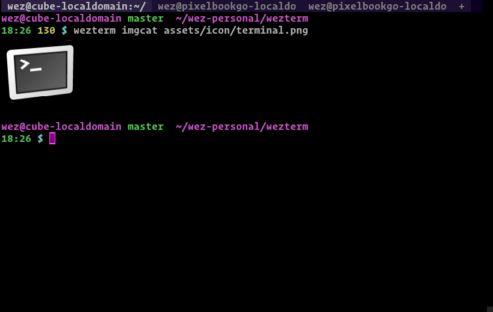

gameterm implements support for the [iTerm2 inline images
protocol](https://iterm2.com/documentation-images.html) and provides a handy
`imgcat` subcommand to make it easy to try out.  Because the protocol is
just a protocol, gameterm's `imgcat` also renders images in iTerm2.

To render an image inline in your terminal:

```console
$ gameterm imgcat /path/to/image.png
```




**Note that the image protocol isn't fully handled by multiplexer sessions
at this time**.


{{since('20220319-142410-0fcdea07')}}

GameTerm supports an extension to the protocol; passing `doNotMoveCursor=1` as
an argument to the `File` escape sequence causes gameterm to not move the cursor
position after processing the image.

